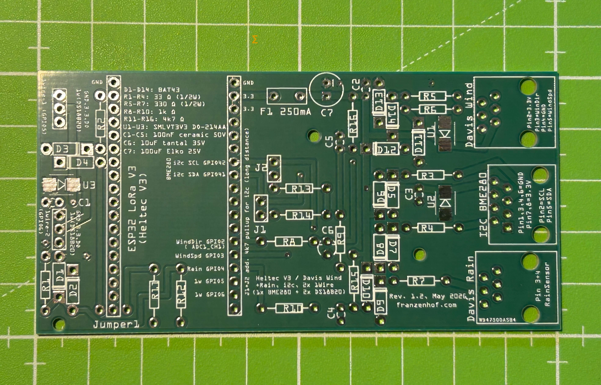
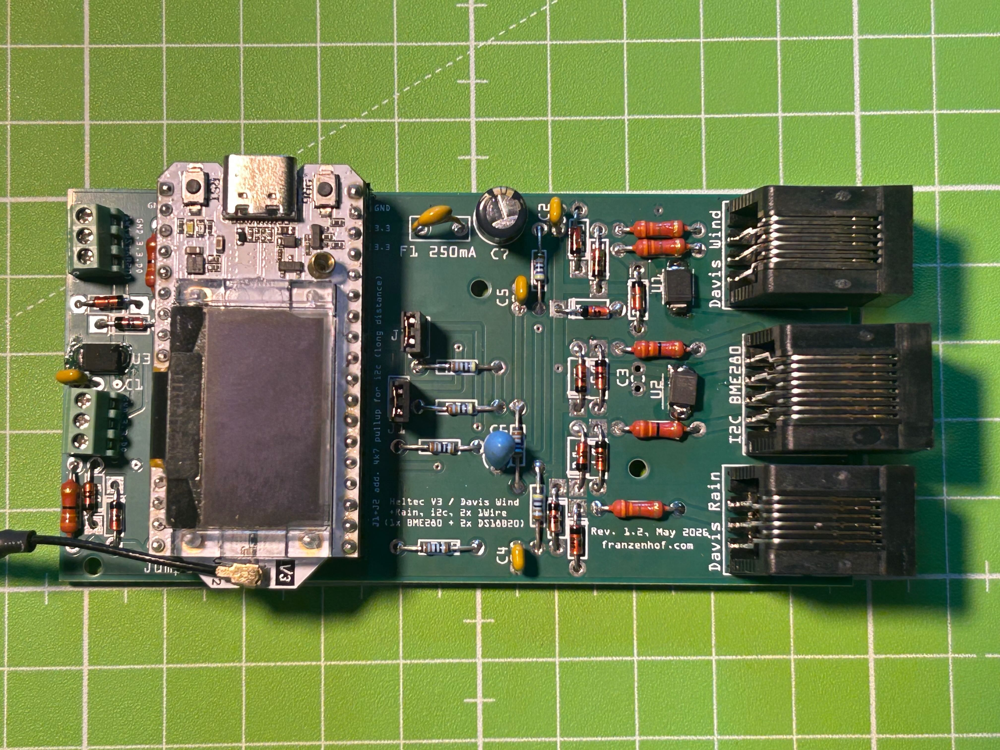
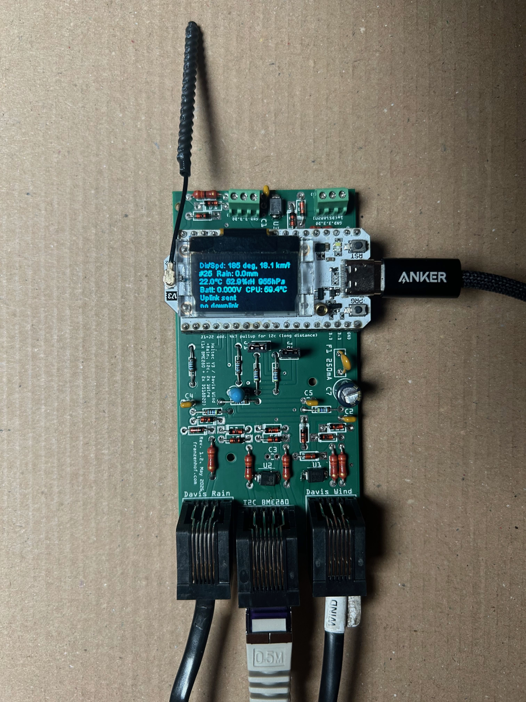
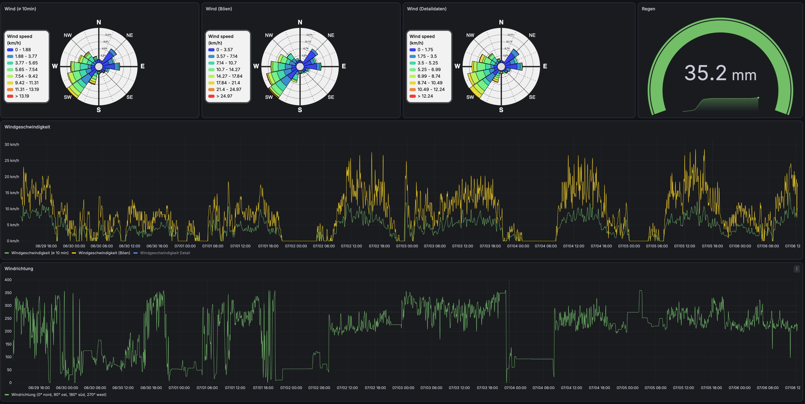
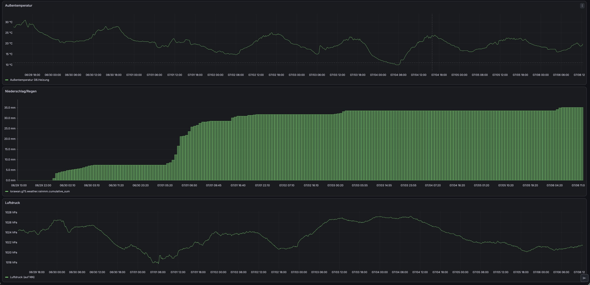
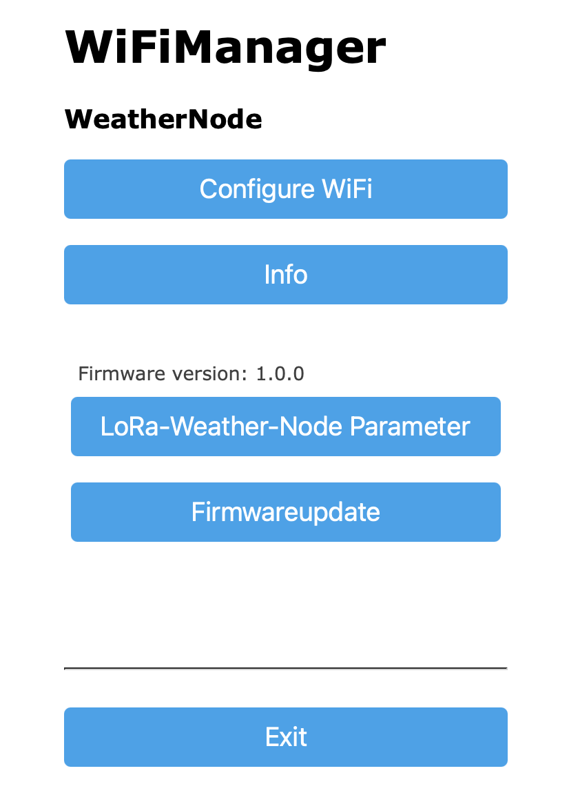
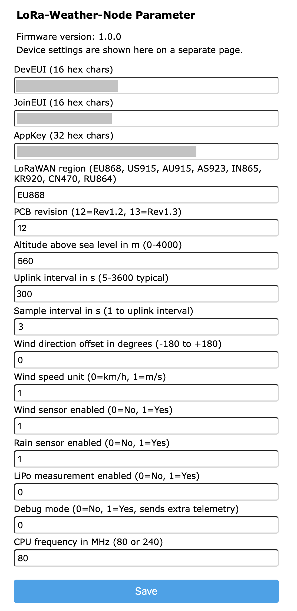
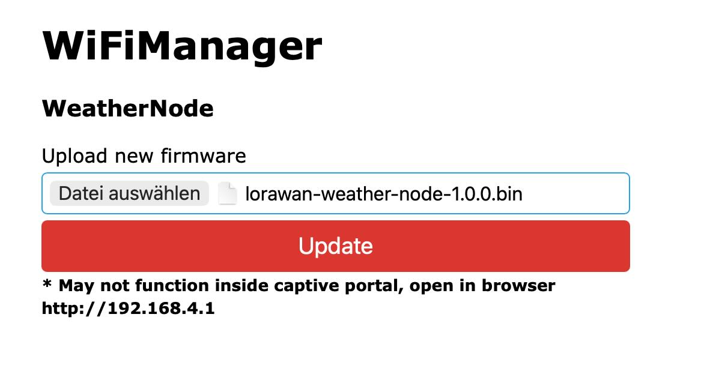
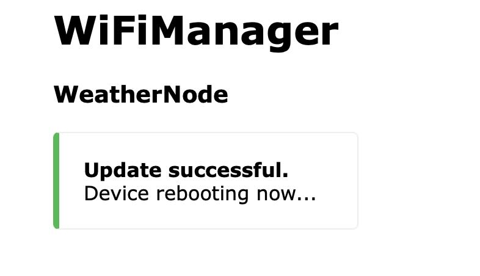

# LoRaWAN Weather Node

Firmware for a custom-designed PCB based on a **Heltec WiFi LoRa 32 V3** (ESP32-S3).  
The node measures wind speed, wind direction, rainfall, temperature, humidity, and barometric pressure and transmits the data via **LoRaWAN (OTAA, region configurable; default: EU868)** to a private ChirpStack server.

The images below give a quick impression of the hardware journey from empty PCB to finished node and show how the measured data can be visualized in Grafana.

## Project in Pictures

<table>
  <tr>
    <td align="center" width="33%">
      
      <br><strong>PCB, empty</strong>
    </td>
    <td align="center" width="33%">
      
      <br><strong>PCB, assembled</strong>
    </td>
    <td align="center" width="33%">
      
      <br><strong>PCB, in operation</strong>
    </td>
  </tr>
</table>

<table>
  <tr>
    <td align="center" width="50%">
      
      <br><strong>Grafana: wind data</strong>
    </td>
    <td align="center" width="50%">
      
      <br><strong>Grafana: rain, temperature and pressure</strong>
    </td>
  </tr>
</table>

The following screenshots show the Wi-Fi configuration flow. This setup is designed to be quick and beginner-friendly, even without USB tools.

<table>
  <tr>
    <td align="center" width="50%">
      
      <br><strong>Wi-Fi manager: start page</strong>
    </td>
    <td align="center" width="50%">
      
      <br><strong>Wi-Fi manager: parameter page</strong>
    </td>
  </tr>
</table>

<table>
  <tr>
    <td align="center" width="50%">
      
      <br><strong>Wi-Fi manager: firmware update</strong>
    </td>
    <td align="center" width="50%">
      
      <br><strong>Wi-Fi manager: update successful</strong>
    </td>
  </tr>
</table>

---

## 📄 License & Open Source

This project is fully open-source. To support both software developers and hardware makers, it is dual-licensed:

* **Software / Firmware:** Licensed under the **[MIT License](LICENSE-SOFTWARE)**. You can freely use, modify, and distribute the code.
* **Hardware (Schematics, PCB & 3D Files):** Licensed under the **[CERN-OHL-P v2](LICENSE-HARDWARE)** (CERN Open Hardware Licence – Permissive). You are free to manufacture, modify, and distribute the hardware designs.

*Developed with 🚜 and 💻 by Gerhard Massenbichler at Franzenhof.*


## Use Case

```
[USB-C power supply] ──► [Heltec WiFi LoRa V3]
                              │        │
                   [Davis 6410]    [BME280 via RJ45]
                   Wind sensor           │
                   │                [DS18B20 × 3]
                   [Davis AeroCone]  [LiPo optional]
                   Rain sensor
                              │
                              [LoRaWAN (default EU868)]
                              │
                       [ChirpStack server]
```

The node runs continuously (no deep sleep), measures without interruption, and transmits a LoRaWAN uplink every configurable number of seconds. Typical uplink interval: 60–300 seconds.

---

## Hardware

| Component | Function |
|-----------|----------|
| Heltec WiFi LoRa 32 V3 | Microcontroller (ESP32-S3), LoRa SX1262, OLED display 128×64 |
| Davis 6410 Anemometer | Wind speed (reed switch) + wind direction (potentiometer 20 kΩ) |
| Davis AeroCone / Standard (typically 6466M) | Rainfall (reed switch, 0.2 mm/pulse) |
| BME280 | Temperature / humidity / barometric pressure (I²C 0x76, up to 2 m RJ45 cable) |
| DS18B20 | Up to 3 temperature sensors (1-Wire, external) |
| LiPo battery | Optional; voltage measurement via voltage divider + ADC |
| Custom PCB Rev 1.2 / 1.3 | ESD protection, pull-ups, RC filter, polyfuse |

### Custom PCB

In addition to mechanically connecting the connectors, the PCB provides the following protection functions for all external interfaces:

- **TVS diodes** (SMLVT3V3) directly at each external connector as primary ESD coarse protection  
- **BAT43 Schottky clamp diodes** as secondary protection clamps before the GPIO pins  
- **Series resistors** (330 Ω / 1 kΩ) for current limiting  
- **RC low-pass filter** (4.7 kΩ + 100 nF, τ ≈ 0.47 ms) for hardware debouncing of the reed switches  
- **Polyfuse F1** (250 mA) for short-circuit protection of the 3.3 V sensor supply  
- **Additional I²C pull-ups** (4.7 kΩ, jumper J1/J2) for longer BME280 cable runs up to 2 m

---

## GPIO Pinout

### Fixed Pins (revision-independent)

| GPIO | Function | Direction | Note |
|------|----------|-----------|------|
| **0** | User button | IN (pull-up) | Short press: display 20 s; long press (≥ 3 s): Wi-Fi portal |
| **1** | LiPo ADC | IN (ADC1_CH0) | Voltage divider R13/R14 (390 Ω / 100 Ω) |
| **37** | BAT_CTRL | OUT | HIGH enables ADC measurement path (Heltec V3 internal from board rev. 3.2) |
| **41** | I²C SDA (BME280) | IN/OUT | Wire2, 50 kHz, address 0x76 |
| **42** | I²C SCL (BME280) | OUT | Wire2 |

### Revision-Dependent Pins

| GPIO Rev 1.2 | GPIO Rev 1.3 | Function |
|:------------:|:------------:|----------|
| **2** | **4** | Wind direction ADC (ADC1_CH1) – Davis potentiometer 0–3.3 V → 0–359°, C6 = 10 µF low-pass |
| **3** | **2** | Wind speed (PCNT Unit 0, reed switch) |
| **4** | **5** | Rain (PCNT Unit 1, reed switch) |
| **5** | **6** | 1-Wire bus (DS18B20, up to 3 sensors) |
| **6** | **3** | unused / free |
| – | **47** | 1-Wire high-side switch (OUT, HIGH = bus powered) |

> The active PCB revision is configured in the Wi-Fi portal (default: **13** for Rev 1.3).

### Wind Sensor (Davis 6410) – RJ11 6-pin

| Pin | Color | Function |
|-----|-------|----------|
| 1 | – | n/c |
| 2 | Yellow | VCC 3.3 V (potentiometer supply) |
| 3 | Green | Wind direction (potentiometer wiper → ADC) |
| 4 | Red | GND |
| 5 | Black | Wind speed (reed switch → PCNT) |
| 6 | – | n/c |

### Rain Sensor (Davis 6466M) – RJ11 6-pin

| Pin | Color | Function |
|-----|-------|----------|
| 3 | Green/Yellow | Reed switch → PCNT |
| 4 | Red | GND |
| others | – | n/c |

> Wire colors 3 and 4 may be swapped depending on the cable batch – both variants work since the reed switch is polarity-independent.

### BME280 – RJ45 (solder module-side onto breakout board)

| Pins | Function |
|------|----------|
| 1, 2, 4, 6 | GND |
| 7, 8 | VCC 3.3 V |
| 3 | SCL |
| 5 | SDA |

> Jumpers J1 and J2 on the PCB activate the additional 4.7 kΩ I²C pull-ups for cable lengths over 0.5 m.

---

## Measurement Principles

### Wind Speed
The Davis 6410 anemometer contains a **reed switch** that closes once per revolution.  
The ESP32 hardware pulse counter (**PCNT**) counts edges without CPU load.  
Conversion per Davis specification:

```
1 revolution/s = 2.25 mph = 3.62 km/h
Wind speed [km/h] = pulses/s × 2.25 × 1.60934
```

The **maximum wind gust** (maximum per uplink interval) is also captured and transmitted separately.

### Wind Direction
The Davis 6410 contains a **potentiometer (20 kΩ)** powered directly from VCC3.3.  
The wiper delivers a linear voltage from 0–3.3 V proportional to 0–359°.  
A configurable **north offset** (–180° to +180°) corrects the mounting orientation.

```
Raw value (0–4095, 12-bit ADC) → map(0, 4095, 0, 359) → + offset → mod 360
```

The low-pass filter C6 (10 µF + potentiometer source impedance ~10 kΩ) gives τ ≈ 100 ms (settling time ~500 ms), which is appropriate for typical vane movement speeds.

### Rainfall
The reed switch in the tipping bucket rain gauge fires one pulse per **0.2 mm of rainfall**.  
PCNT counts pulses in hardware. Rain rate is calculated as mm/h from the interval:

```
Rain [mm] = pulses × 0.2
Rain rate [mm/h] = rain [mm] / (interval [ms] / 3,600,000)
```

The since-start accumulator (`rainMMSinceStart`) survives normal operation in **RTC_DATA_ATTR** (lost on power interruption, resettable via downlink `0x01`).

### Temperatures (DS18B20)
Up to **3 sensors per bus** are detected automatically (`getDeviceCount()`).  
The index corresponds to the order of ROM addresses on the bus.

### Barometric Pressure (BME280)
The measured absolute pressure is converted to **sea level (QNH)** when a station altitude is configured:

```
QNH = absolute pressure × (1 - 0.0000226 × altitude[m])^(-5.255)
```

---

## CayenneLPP Payload Channels

| Channel | Type | Content | Unit | Active when |
|---------|------|---------|------|-------------|
| Ch 1 | Direction | Wind direction | ° | `windEn = 1` |
| Ch 1 | Analog Input | Avg wind speed | m/s or km/h | `windEn = 1` |
| Ch 2 | Analog Input | Wind gust (maximum) | m/s or km/h | `windEn = 1` |
| Ch 3 | Analog Input | Rain rate | mm/h | `rainEn = 1` |
| Ch 1 | Distance | Rain current cycle | mm | `rainEn = 1` |
| Ch 2 | Distance | Rain since start | mm | `rainEn = 1` |
| Ch 2 | Digital Input | Status bitfield (BME280, 1-Wire, send-fail count, wind unit) | bitfield | always |
| Ch 200 | Digital Input | Cycle counter (debug) | 0–255 | `debugMode = 1` |
| Ch 202 | Digital Input | Send fail counter (debug) | 0–255 | `debugMode = 1` |
| Ch 201 | Temperature | CPU temperature (debug) | °C | `debugMode = 1` |
| Ch 203 | Analog Input | Free heap (debug) | KiB | `debugMode = 1` |
| Ch 204 | Analog Input | Uptime (debug) | h | `debugMode = 1` |
| Ch 1 | Voltage | LiPo voltage | V | `lipoEn = 1` |
| Ch 1 | Rel. Humidity | Humidity | % | BME280 detected |
| Ch 1 | Baro. Pressure | Barometric pressure QNH | hPa | BME280 detected |
| Ch 2 | Baro. Pressure | Barometric pressure absolute | hPa | BME280 detected |
| Ch 1 | Temperature | BME280 temperature | °C | BME280 detected |
| Ch 2–4 | Temperature | DS18B20 sensor 0–2 | °C | sensor detected |

> **Rain encoding note:** The payload uses the CayenneLPP **Distance** type for rain values, but in this project it is interpreted as **mm** (`rain_cycle_mm`, `rain_since_start_mm`).
> Use the provided decoder in [chirpstack/decoder.js](chirpstack/decoder.js). Generic CayenneLPP decoders might assume meters, but you have to know the values are millimeters.

> In normal operation (`debugMode = 0`) no debug telemetry is sent.

> **Payload size:**  
> Minimal config (DS18B20 only): approx. 15–30 bytes – fits in DR0 (SF12, 51 bytes).  
> Full config (wind + rain + BME280 + 3× DS18B20 + LiPo): approx. 70–75 bytes – requires **DR2 (SF10)** or higher.  
> With a private ChirpStack server and normal gateway distance this is not an issue.

---

## Initial Configuration (Wi-Fi Portal)

### First boot
On first power-up (no DevEUI stored in NVS) the Wi-Fi portal opens **automatically**:

1. The OLED display shows **"Config Portal"**, the AP SSID, the URL and brief instructions
2. Connect your phone or laptop to the Wi-Fi network **"WeatherNode"** (no password)
3. Open **`http://192.168.4.1`** in a browser (most devices redirect automatically)
4. Enter all parameters and click *Save* → the device restarts automatically

### Re-opening the portal later
The portal can be opened at any time in two ways:

| Method | How |
|--------|-----|
| **Button long press** | Hold the user button (GPIO 0) for **≥ 3 seconds** during normal operation |
| **LoRaWAN downlink** | Send byte `0x03` on FPort 1 (takes effect after the current send cycle) |

> **Note:** GPIO 0 must **not** be pressed during power-on or reset – this would activate the ESP32 bootloader instead of the firmware. The portal is therefore triggered by a long press *during operation* only.

### Firmware update via Wi-Fi portal (OTA)
Firmware updates can be done wirelessly while the portal is open:

1. Open the Wi-Fi portal (either long press on user button for at least 3 seconds, or LoRaWAN downlink `0x03`)
2. Connect to the board Wi-Fi **WeatherNode**
3. Open **http://192.168.4.1** in a normal browser
4. On the portal start page, click **Firmwareupdate**
5. Upload the `.bin` file and wait until the board reboots

> If the captive portal page does not allow file upload, open **http://192.168.4.1/update** directly in the browser.

| Parameter | Description | Default |
|-----------|-------------|---------|
| DevEUI | 16 hex chars, from ChirpStack | – |
| JoinEUI | 16 hex chars, from ChirpStack | – |
| AppKey | 32 hex chars, from ChirpStack | – |
| LoRaWAN region | `EU868`, `US915`, `AU915`, `AS923`, `IN865`, `KR920`, `CN470`, `RU864` | EU868 |
| PCB revision | 12 = Rev 1.2, 13 = Rev 1.3 | 13 |
| Altitude above sea level (m) | Station altitude for QNH calculation | 560 |
| Uplink interval (s) | Target interval per measurement cycle | 300 |
| Sample interval (s) | Sub-sample interval within a cycle; ≤ uplink interval | 3 |
| Wind speed unit (0=km/h, 1=m/s) | Unit used for transmitted wind speed and gust values | 1 |
| Wind direction offset (°) | North correction during installation (−180 to +180) | 0 |
| Wind sensor (1=Yes) | Davis wind sensor enabled | 1 |
| Rain sensor (1=Yes) | Davis rain sensor enabled | 1 |
| LiPo measurement (1=Yes) | Voltage measurement via voltage divider enabled | 0 |
| Debug mode (1=Yes) | Adds cycle counter, CPU temp and extra diagnostics in high LPP channels | 0 |
| CPU frequency (80/240 MHz) | 80 MHz saves power; below 80 MHz not allowed (PCNT-APB dependency) | 80 |

> All settings are stored persistently in the **NVS (Non-Volatile Storage)** of the ESP32-S3 and survive restarts and firmware updates.

> Region input in the portal is validated. Unsupported values fall back to **EU868**.

### Debug mode

`debugMode` was introduced to support bench testing (for example without connected weather sensors) and fast diagnostics without affecting normal airtime.

When enabled, the node adds extra telemetry to high LPP channels (200+):

1. Cycle counter
2. CPU temperature
3. Send-fail counter
4. Free heap (KiB)
5. Uptime (hours)

When disabled (default), these values are not part of the uplink payload.

---

## User Button (GPIO 0)

| Press duration | When | Action |
|---------------|------|--------|
| — | First boot (no DevEUI stored) | Wi-Fi portal opens automatically |
| Short press (< 3 s, on release) | Normal operation | Turn on OLED display for 20 s |
| Long press (≥ 3 s) | Normal operation or setup loops (join retries etc.) | Open Wi-Fi config portal → save → restart |

Button presses are detected via a **hardware interrupt** (GPIO CHANGE), so a short press is never missed – even while the LoRa send/receive window is blocking the main task for several seconds.

The display is **off** during normal operation to protect the SSD1306 driver and save power. It turns off automatically after 20 seconds. During the startup sequence (radio init, LoRaWAN join retries) the display stays on permanently so that status and error messages remain visible.

---

## ChirpStack Payload Decoder

The file `chirpstack/decoder.js` contains the JavaScript decoder for ChirpStack v3 and v4.

> **Tip:** The decoder file can also be downloaded directly from the device via the Wi-Fi config portal (*Payload decoder (JS)* button on the start page). The downloaded file is always version-matched to the running firmware.

**Adding the decoder to ChirpStack:**
1. In the ChirpStack web interface: *Device Profiles → Codec → JavaScript codec functions*
2. Paste the contents of `chirpstack/decoder.js`
3. Save – all values will appear as named JSON fields in the uplink events

**Example output (JSON):**
```json
{
  "wind_direction_deg": 247,
  "wind_speed_avg": 12.30,
  "wind_gust": 18.50,
  "rain_rate_mmh": 0.00,
  "rain_cycle_mm": 0.0,
  "rain_since_start_mm": 14.2,
  "cycle_counter": 42,
  "status": {
    "bme280_present": true,
    "bus1_has_sensors": true,
    "send_fail_count": 0,
    "wind_speed_unit": "m/s"
  },
  "battery_v": 3.98,
  "bme280_humidity_pct": 67.5,
  "bme280_pressure_qnh_hpa": 1013.2,
  "bme280_pressure_abs_hpa": 952.1,
  "bme280_temperature_c": 21.3,
  "ds18b20_0_c": 18.6,
  "ds18b20_1_c": 19.1
}
```

**Rain accumulator evaluation:**  
`rain_since_start_mm` is a cumulative counter. The delta between two received packets gives the actual rainfall – even if packets were lost in between.

---

## TTN (The Things Stack) Instead of Private ChirpStack

The node can be used with TTN/TTS as well. No payload format change is required, because the uplink is still standard CayenneLPP and the same decoder logic can be used.

### What to configure

1. In the Wi-Fi portal, set **LoRaWAN region** to the matching regional plan of your TTN deployment (for Europe typically `EU868`).
2. In TTN, create an end device using **OTAA**, LoRaWAN 1.0.x profile, and copy **DevEUI / JoinEUI / AppKey** into the node portal.
3. Add the payload formatter (JavaScript) in TTN by reusing [chirpstack/decoder.js](chirpstack/decoder.js) logic (field names can stay the same).

### Fair-use and practical intervals (EU868)

TTN strongly favors low airtime and low uplink rates. Practical guidance for weather telemetry:

1. Prefer **60 s to 300 s** uplink intervals.
2. Avoid high-spreading-factor operation with very short intervals.
3. Keep payload compact (disable unused sensors in the portal).

For TTN community networks, very short uplink intervals are generally not appropriate and may violate fair-use expectations depending on data rate and gateway conditions.

For TTN operation, keep `debugMode` disabled except for short troubleshooting windows.

### Do you need further firmware changes for TTN?

In most cases: **no functional code changes** are required. The key points are correct region and OTAA credentials.

---


## LoRaWAN Downlink Commands

Downlinks are sent on **FPort 1** with a single byte:

| Byte | Function |
|------|----------|
| `0x01` | Reset rain accumulator (rain since start) to 0 |
| `0x02` | Restart device (triggers a new OTAA join) |
| `0x03` | Open Wi-Fi config portal (takes effect after the current send cycle completes) |
| `0x04` | Enable debug mode (persistent) |
| `0x05` | Disable debug mode (persistent) |

Parameter updates are sent on **FPort 1** with command `0x10`:

`[0x10, paramId, valueMSB, valueLSB, ...]`

Multiple parameter triplets may be included in one downlink. Values are interpreted as signed 16-bit and validated.

| Param ID | Parameter | Valid range / values |
|----------|-----------|----------------------|
| `1` | `uplinkIntervalSec` | `5..3600` |
| `2` | `sampleSec` | `1..uplinkIntervalSec` |
| `3` | `windEn` | `0` or `1` |
| `4` | `rainEn` | `0` or `1` |
| `5` | `lipoEn` | `0` or `1` |
| `6` | `debugMode` | `0` or `1` |
| `7` | `windDirOffsetDeg` | `-180..180` |
| `8` | `windUnitMs` | `0` or `1` |
| `9` | `cpuFreqMhz` | `80` or `240` |

Valid parameters are stored persistently in NVS immediately.

---

## Error Handling / Robustness

### Watchdog Timer
A **hardware watchdog** (120 s timeout) protects against hanging code.  
It is activated only **after a successful LoRaWAN join** – allowing slow joins and Wi-Fi portal operation to run without a WDT reset.

### Automatic Restart on Send Failures
After **10 consecutive send failures** an automatic restart is triggered to renew the LoRaWAN join (e.g. after gateway outage or session timeout).

### ADC Averaging
Wind ADC (direction) and battery ADC are averaged over **8 samples** to reduce ESP32-S3 ADC noise.

---

## Uplink Interval and Timing

The configured uplink interval is a **target value**: at the end of each cycle the code only waits the remaining time until the target interval (`millis()` delta). This prevents the measurement time (1-Wire conversion ~750 ms, LoRa airtime ~500 ms) from adding up twice.

```
Cycle start → measure → send → sleep(max(0, target − elapsed))
```

`Sample interval` and `Uplink interval` have different roles:

- **Sample interval** (`sampleSec`): defines how often sub-samples are taken within one uplink cycle.
- **Uplink interval** (`uplinkIntervalSec`): defines when one uplink is generated from the accumulated sub-samples.

Within one send cycle, values are combined as follows:

- **Wind speed (avg)**: arithmetic mean of all wind speed sub-samples.
- **Wind gust (max)**: maximum wind speed seen in all sub-samples of that cycle.
- **Wind direction**: vector average (sin/cos) across all sub-samples.
- **Rain cycle**: sum of rain pulses within the cycle.
- **Rain rate**: derived from the cycle rain amount and full cycle duration.
- **BME280 temperature/humidity/pressure**: arithmetic mean of all BME280 sub-samples.
- **DS18B20 temperatures**: measured once per uplink cycle (not sub-sampled/averaged over `sampleSec`).

**Minimum practical interval** in EU868 at DR5 (SF7): ~5 s (duty cycle restriction).  
For TTN/community networks, use significantly longer intervals (typically at least 60 s).  
**Default values:** uplink interval `300 s`, sample interval `3 s`.

---

## PCB Revisions

| Revision | Status | GPIO Wind Speed | GPIO Wind Dir | GPIO Rain | GPIO 1-Wire |
|----------|--------|:---------------:|:-------------:|:---------:|:-----------:|
| **Rev 1.2** | In use | GPIO 3 | GPIO 2 | GPIO 4 | GPIO 5 |
| **Rev 1.3** | In preparation | GPIO 2 | GPIO 4 | GPIO 5 | GPIO 6 |

> Rev 1.3: The 5V input on the PCB (overvoltage protected) connects directly to the **5V pin of the Heltec WiFi LoRa V3** (Pin 2 on the J2 header of the controller board). GPIO 7 is completely free and unused.

> **Note on current firmware:** Both revisions now support only **one** 1-Wire bus (Rev 1.2: GPIO 5, Rev 1.3: GPIO 6). The former second bus is no longer addressed by the software.

**Changes in Rev 1.3 vs. 1.2:**
- TVS diode (SMLVT3V3 / U4) added at rain sensor connector
- GPIO numbers shifted by one (GPIO 3 was close to JTAG)
- 2nd 1-Wire bus removed; GPIO 6 freed → slot used for the 5V input

---

## Project Structure

```
├── src/
│   └── main.cpp             # Complete firmware
├── chirpstack/
│   └── decoder.js           # ChirpStack v3/v4 JavaScript payload decoder
├── pcblayout/
│   ├── pcb-layout with esd protection.fzz        # Fritzing Rev 1.3
│   ├── pcb-layout with esd protection_Schaltplan.png
│   ├── pcb-layout with esd protection_Leiterplatte.png
│   ├── pcb-layout with esd protection_bom.html
│   ├── pcb-layout with esd protection rev12.zip  # Gerber files Rev 1.2
│   ├── pcb-layout with esd protection rev13.zip  # Gerber files Rev 1.3
│   └── design_readme.txt    # Connector pin assignments
├── platformio.ini
└── README.md
```

---

## Libraries

| Library | Version | Purpose |
|---------|---------|---------|
| RadioLib | ^7.6.0 | LoRaWAN stack (OTAA, EU868) |
| Heltec_ESP32_LoRa_v3 | ^0.9.2 | Board support (display, heltec_temperature) |
| LoRaWAN_ESP32 | ^1.2.0 | LoRaWAN session management (persistence) |
| CayenneLPP | ^1.6.1 | Payload encoding |
| WiFiManager | ^2.0.16-rc.2 | Wi-Fi configuration portal |
| Adafruit BME280 | ^2.2.4 | BME280 driver |
| Adafruit Unified Sensor | ^1.1.15 | Sensor abstraction |
| OneWire | ^2.3.8 | 1-Wire protocol |
| DallasTemperature | ^4.0.6 | DS18B20 driver |
| esp_task_wdt | (IDF built-in) | Hardware watchdog |

---

## Technical Notes

### PCNT and CPU Frequency
The hardware pulse counter (PCNT) uses the **APB clock** for its debounce filter.  
At CPU frequencies ≥ 80 MHz (PLL mode) the APB clock stays constant at 80 MHz.  
Below 80 MHz (XTAL mode) the APB clock drops proportionally → debounce filter timing becomes invalid.  
**Minimum allowed CPU frequency: 80 MHz.**

### 1-Wire with Runtime-Configured Pins
Because the GPIO numbers for 1-Wire are determined at runtime from the PCB revision, the `OneWire` and `DallasTemperature` objects are allocated on the heap with `new` (no static constructor with hard-coded pins possible).

### LoRaWAN Session Persistence
The `LoRaWAN_ESP32` library stores the LoRaWAN session (frame counters, DevAddr, session keys) in NVS. A restart does not necessarily trigger a new OTAA join.

### ADC Linearity
The ESP32-S3 ADC is non-linear (especially below 150 mV and above 3.1 V). For the wind direction potentiometer this is uncritical since values are mapped to 0–359° and the absolute measurement error remains < 5° in practice. For the battery voltage measurement a calibration factor is included in the code.
